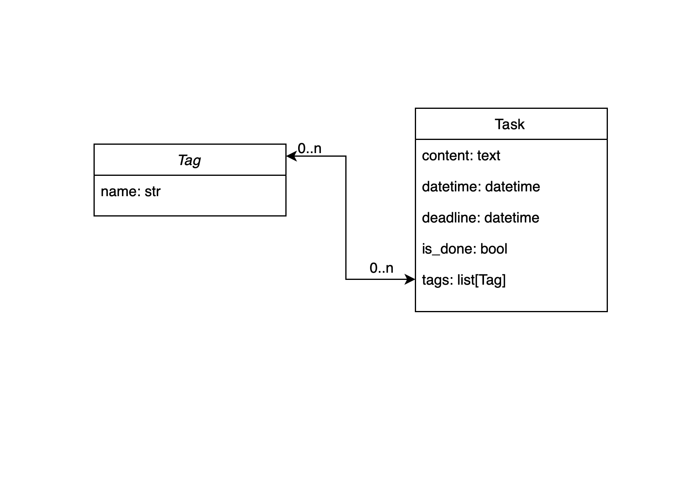

Name of project: Todo list.

Project overview.

This WEB application was created as part of the homework of Python developer 
study course in the Mate Academy.
The main purpose of this WEB application is to provide task management system 
in form of so called todo list.

Configuration.

This WEB application was build using MVT (model view template) pattern of 
DJANGO ORM framework and Django Bootstrap template.

Installation instructions

In order to run the project following packages have to be installed:
* asgiref==3.8.1
* black==25.1.0
* click==8.1.8
* crispy-bootstrap4==2024.10
* Django==4.2
* django-crispy-forms==2.3
* django-debug-toolbar==3.2.4
* flake8==5.0.4
* flake8-quotes==3.3.1
* flake8-variables-names==0.0.5
* mccabe==0.7.0
* mypy-extensions==1.0.0
* packaging==24.2
* pathspec==0.12.1
* pep8-naming==0.13.2
* platformdirs==4.3.7
* pycodestyle==2.9.1
* pyflakes==2.5.0
* sqlparse==0.5.3

Operating instructions.

All pages equipped with navigation panel located on the left side of the page. The navigation 
options are: Home and Tags. Home lists all tasks and Tags lists all tags.

DB consists of 2 models: Task and Tag.
A task can have multiple tags and a tag can be in multiple tasks.
The Home page displays todo list which consists of Tasks where all information about task is displayed. 
Tasks are ordered from not done to done and from newest to oldest.
There are buttons to Add a new task and Delete task.
There are links for each task for updating and deletion.
Each task has two options of status: Done and Not done.
User can change this status by pressing buttons Complete or Undo.
The Tag page displays all tags.
Each displayed tag has Update and Delete buttons.
There is also Add new tag button.
